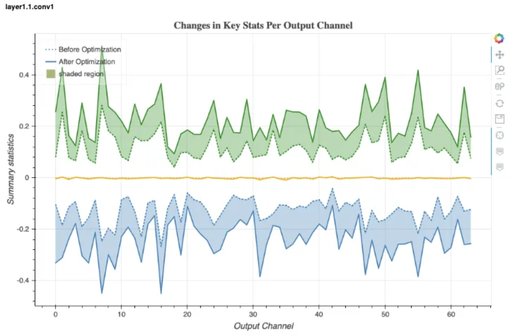

AIMET Tests

Exploring Qualcomm's AIMET library to quantise and prune deep learning models. 

# AIMET

→ AI Model Efficiency Toolkit from Qualcomm. 

→ Its two main capabilities are compression and quantisation. 

### Compression

Tried Spatial SVD where a larger convolution is replaced with two smaller convolution operators such that the output is the same. This greatly reduces MACs for a given Conv layer and slightly reduces memory footprint because of the smaller matrices. 

**Weight SVD** 

Given a layer’s kernel with weight tensor of shape (𝑚,𝑛,ℎ,𝑤), where 𝑚 is the input channels, 𝑛 the output channels, and ℎ, 𝑤 giving the height and width of the kernel itself, Weight SVD will decompose the kernel into one of size (𝑚,𝑘,1,1) and another of size (𝑘,𝑛,h,𝑤), where 𝑘 is the rank. 

The smaller the value of 𝑘 the larger the degree of compression achieved. This decomposition is done on the outputs dimension. Weight SVD is supported for Conv2D and FullyConnected layers. 

**Spatial SVD**

Spatial SVD is another tensor decomposition technique that decomposes one large layer, in terms of memory or MACs, into two smaller layers. Given a Conv layer, with kernel (𝑚,𝑛,ℎ,𝑤), Spatial SVD will decompose the kernel into two kernels. One of size (𝑚,𝑘,ℎ,1) and one of size (𝑘,𝑛,1,𝑤), where k is called the rank. 

The smaller the value of k the larger the degree of compression achieved.

### BatchNorm Folding

This is the technique used in Cross-Layer Weight Equalisation in the compression API in AIMET. 

The batch norm terms are distributed across the preceding Conv operator instead of being a separate operator. The BatchNorm matrix is then replaced with an identity matrix of suitable size since it is now redundant. 

Refer: https://nathanhubens.github.io/fasterai/bn_folding.html

### Quantisation

Paper: https://arxiv.org/pdf/1906.04721.pdf

AIMET does not actually quantise the FP32 module to INT8 directly. It instead augments the FP32 model by inserting Quantisation-DeQuantisation blocks before operators and calibrates the model such when it is quantised to INT8 while deployment, there is no significant loss in accuracy. 

**Data-Free Quantisation**

This is an AIMET algorithm that does

1. Cross-layer Equalisation → Equalise weight tensors to reduce amplitude variation across channels. This can be done by exploiting the fact one can do rescaling and reparameterisation of the inner multiplications to make it more robust to quantisation. 
2. Bias Absorption → High biases are absorbed into the subsequent layer. 
3. Quantisation → Simulate quantised performance with INT8 activations and input.
4. Bias Correction → Explained below. 

### Quantisation Bias

Paper: https://arxiv.org/pdf/1906.03193.pdf

This explains how the degradation in performance after naively converting FP32 → INT8 is due to a systemic bias introduced in the mean activation values across layers that together add up. The data free way to fix this bias is to estimate the shift in each layer by observing the distribution of activation values over several inference runs with representative data and correcting this shift iteratively by adding to the existing bias term for each layer. 

This method can be further extended by actually doing back propagation as well for fine-tuning the weights. AIMET supports both these workflows. 

### Visualisations

AIMET provides visualisation capabilities over a Bokeh server. The visualisation image shows the differences in the max, avg, and min values of the weights in each channel of two conv layers in a ResNet model before and after applying cross-layer equalisation. In the conv1 layer the amplitudes were increased, while in the conv2 layer the spread was reduced.

